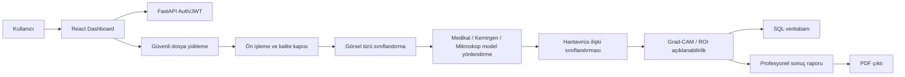

# Sistem Mimarisi

1. Kullanıcı JWT oturumuyla panele giriş yapar.
2. Görsel drag & drop yükleme alanına bırakılır.
3. Backend dosya uzantısı, içerik türü, boyut ve gerçek görüntü formatını doğrular.
4. Görsel kalite metrikleri hesaplanır: çözünürlük, kontrast, parlaklık, odak/blur ve renk dağılımı.
5. Görsel türü sınıflandırma hattı görüntüyü akciğer röntgeni, CT/MR, mikroskop, kemirgen, laboratuvar/doku veya belirsiz kategoriye yönlendirir.
6. Uygun model hattı seçilir: medikal görüntü analizi, kemirgen taşıyıcı tespiti veya mikroskop/doku analizi.
7. Hantavirüs ilişkili bulgu sınıflandırması güven skoru ve risk seviyesi üretir.
8. Açıklanabilir AI katmanı Grad-CAM/ROI bölgelerini döndürür.
9. Analiz JSON sonucu veritabanına kaydedilir.
10. Kullanıcı sonucu dashboardda inceler veya PDF raporu indirir.

## Model Entegrasyonu

`backend/app/services/pipeline.py` dosyası üretim model entegrasyonu için ayrılmıştır. Her aşama gerçek model servislerine taşınabilir:

- PyTorch `torchscript` veya `safetensors` model yükleme
- TensorFlow SavedModel
- ONNX Runtime
- Harici model servisleri
- DICOM ön işleme ve PACS entegrasyonu

API sözleşmesi değişmeden kalır; frontend `imageType`, `hantavirusResult`, `confidence`, `riskLevel`, `attention` ve `warnings` alanlarını tüketir.
